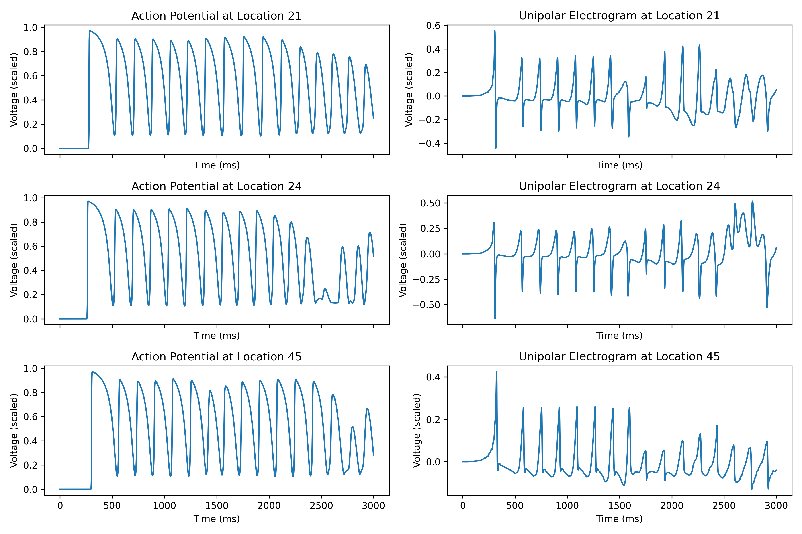
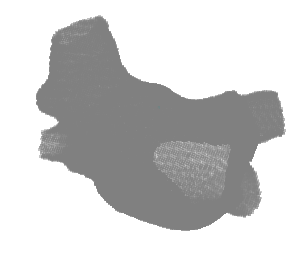
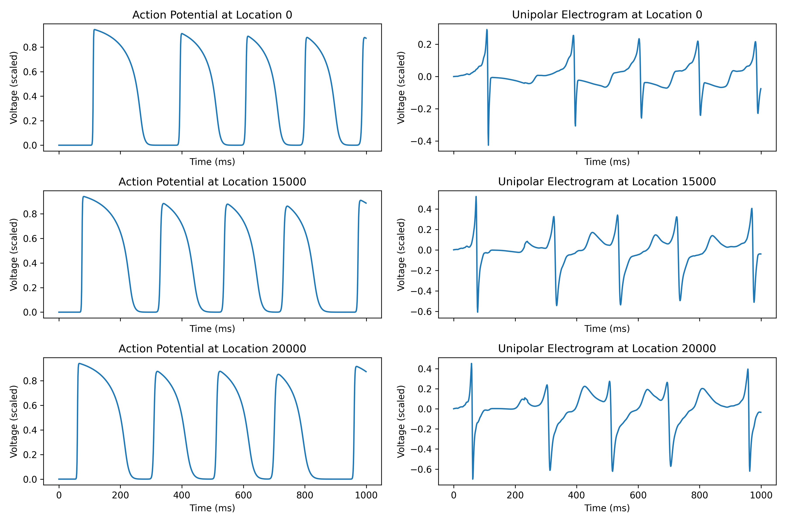
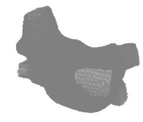
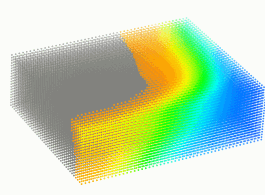

# Demonstration
Atrial fibrillation of a patient's left atrium:  
  
  

# Introduction
- This is an electrophysiological heart simulator written in **Python**.  
- Patient atria: A 3D triangular mesh database of the left and/or right **atria** from **more than 100 patients** are provided.  
- Heart model: 
  - **Mitchell-Schaeffer**  
  - **Aliev-Panfilov**  
- Capability:  
  - It can simulate patient-specific focal and rotor **arrhythmias**, as well as fibrillation.  
  - It computes **action potentials** and **electrograms**.  
  - Besides 3D, it can also run 2D simulation.  
- Programming:  
  - It is deliberately written in a procedural programming style, using **simple** function calls rather than object oriented constructs like classes and inheritance, to maintain simplicity and ease of debugging.  
  - The code runs on Nvidia **GPU** for fast parallel computing.  
  - For solving the heart model equations, 4th-order Runge–Kutta is implemented for the reaction part, and Crank-Nicolson is implemented for the diffusion part.  

# Instructions
- Best to use Visual Studio Code on the Ubuntu Linux operating system. Edit /.vscode/settings.json to set your "python.defaultInterpreterPath".
- Run **heart_sim_individual.py** to compute a heart simulation. 
- Folder structure:  
  ├─ example/, examples of simulations.  
  ├─ legacy/, old functions that no longer in use, keeping them because they may be useful in the future.  
  ├─ mesh_database/, 3D triangular mesh database of the left and/or right atria from more than 100 patients.  
  ├─ simulation/, functions for running heart simulations.  
  └─ utility/, functions for mesh processing, display, analysis, debug, etc.  

# Contributors
- **Jiyue He** -- Owner and the main contributor. Jiyue He (Jay) received his PhD from the University of Pennsylvania, where he was honored with the student recognition award. As of 2026, He is a Postdoctoral Scholar at the University of California, San Francisco. His research includes artificial intelligence, numerical modeling, algorithm development, signal processing and data analysis.
- **Mason Manetta** -- Implemented mesh processing to automatically correct defects and smooth the surface while preserving overall geometry. As of 2026, Manetta is a Bioengineering PhD student at the University of California, Berkeley and the University of California, San Francisco. His research includes wearable medical devices, electrical impedance tomography, sleep genetics, and cardiac physiology.
- **John Bullinga** -- Provided the de-identified patient atria 3D triangular meshes. As of 2026, Bullinga serves as the Director of Electrophysiology Laboratories at Penn Presbyterian Medical Center of the University of Pennsylvania Health System.  
- **Jan Christoph** -- Financial support. As of 2026, Christoph is an Assistant Professor at the University of California, San Francisco, and head of the Cardiac Vision Laboratory. He is a faculty member of the Cardiovascular Research Institute, with appointments in the Division of Cardiology, School of Medicine, and the Department of Bioengineering and Therapeutic Sciences. His research interests include cardiac electrophysiology and biomechanics, cardiac arrhythmia mechanisms, the physics of complex biological systems, artificial intelligence, numerical modeling and imaging.

# The papers used this heart simulator
- Jiyue He, Arkady Pertsov, John Bullinga, Rahul Mangharam. (2023). Individualization of atrial tachycardia models for clinical applications: Performance of fiber-independent model. IEEE Transactions on Biomedical Engineering, vol. 71, no. 1, pp. 258-269. doi: 10.1109/TBME.2023.3298003
- Jiyue He, Arkady Pertsov, Elizabeth Cherry, Flavio Fenton, Caroline Roney, Steven Niederer, Zirui Zang, Rahul Mangharam. (2023). Fiber Organization Has Little Effect on Electrical Activation Patterns During Focal Arrhythmias in the Left Atrium. IEEE Transactions on Biomedical Engineering, vol. 70, no. 5, pp. 1611-1621. doi: 10.1109/TBME.2022.3223063
- Jiyue He, Arkady Pertsov, Rahul Mangharam. (2023). Real-time atrial tachycardia ablation guidance with a left atrium model. Heart Rhythm Society Abstract, volume 20, issue 5. doi: 10.1016/j.hrthm.2023.03.343
- Jiyue He, Arkady Pertsov, Sanjay Dixit, Katie Walsh, Eric Toolan, Rahul Mangharam. (2021). Patient-specific heart model towards atrial fibrillation. Proceedings of the ACM/IEEE 12th International Conference on Cyber-Physical Systems, New York, NY, USA, pp. 33-43. doi: 10.1145/3450267.3450532

# More demonstrations
Rotor arrhythmia on a patient's left atrium:  
  
  

2 focal source simulation on a patient's left atrium:  
  

Fibrillation on a slab:  
  

2D simulation that has 2 focal sources:  
  
