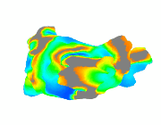
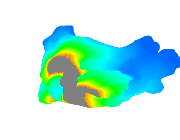
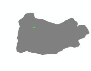

  

# Introduction
- This is an electrophysiological heart simulator written in **Python**.  
- Patient atria: A 3D triangular mesh database of the left and/or right atria from **more than 100 patients** are provided.  
- Heart model: Can choose **Mitchell-Schaeffer** or **Aliev-Panfilov**.  
- Capability:  
  - It can simulate patient-specific focal and rotor **arrhythmias**, as well as fibrillation.  
  - It computes **action potentials** and **electrograms**.  
  - Besides 3D, it can also run 2D simulation.  
- Programming:  
  - It is deliberately written in a procedural programming style, using **simple** function calls rather than object oriented constructs like classes and inheritance, to maintain simplicity and ease of debugging.  
  - The code runs on Nvidia **GPU** for fast parallel computing.  
  - For solving the heart model equations, 4th-order Runge–Kutta is implemented for the reaction part, and Crank-Nicolson is implemented for the diffusion part.  

# Instruction
- Best to use Visual Studio Code on the Ubuntu Linux operating system. Edit /.vscode/settings.json to set your "python.defaultInterpreterPath".
- Run **heart_sim_individual.py** to compute one heart simulation. 
- Run heart_sim_batch.py to compute multiple heart simulations.  
- Folder structure:  
  |-- demonstration, examples of simulations.  
  |-- geometry_processing, functions for processing patient atrial meshes and converting them into Cartesian voxels for heart simulations.  
  |-- legacy, old functions that no longer in use, keeping them because they may be useful in the future.  
  |-- patient_atrium_mesh_database, 3D triangular mesh database of the left and/or right atria from more than 100 patients.  
  |-- simulation, functions for running heart simulations.  
  └-- utility, functions for display, analysis, debug, etc.  

# Contributors
- **Jiyue He** -- Owner and the main contributor. Jiyue He (Jay) received his PhD from the University of Pennsylvania, where he was honored with the student recognition award. As of 2026, He is a Postdoctoral Scholar at the University of California, San Francisco. His research includes artificial intelligence, numerical modeling, algorithm development, signal processing and data analysis.
- **Mason Manetta** -- Implemented mesh processing to automatically correct defects and smooth the surface while preserving overall geometry. As of 2026, Manetta is a Bioengineering PhD student at the University of California, Berkeley and the University of California, San Francisco. His research includes wearable medical devices, electrical impedance tomography, sleep genetics, and cardiac physiology.
- **John Bullinga** -- Provided the de-identified patient atria 3D triangular meshes. As of 2026, Bullinga serves as the Director of Electrophysiology Laboratories at Penn Presbyterian Medical Center of the University of Pennsylvania Health System.  
- **Jan Christoph** -- Financial support. As of 2026, Christoph is an Assistant Professor at the University of California, San Francisco, and head of the Cardiac Vision Laboratory. He is a faculty member of the Cardiovascular Research Institute, with appointments in the Division of Cardiology, School of Medicine, and the Department of Bioengineering and Therapeutic Sciences. His research interests include cardiac electrophysiology and biomechanics, cardiac arrhythmia mechanisms, the physics of complex biological systems, artificial intelligence, numerical modeling and imaging.

# Examples of simulations
Atrial fibrillation of a patient's left atrium:  
  
  

Rotor arrhythmia of a patient's left atrium:  
  
  

Focal arrhythmia of a patient's left atrium:  
  
  
