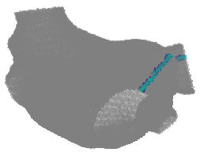
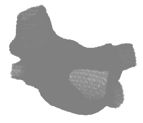
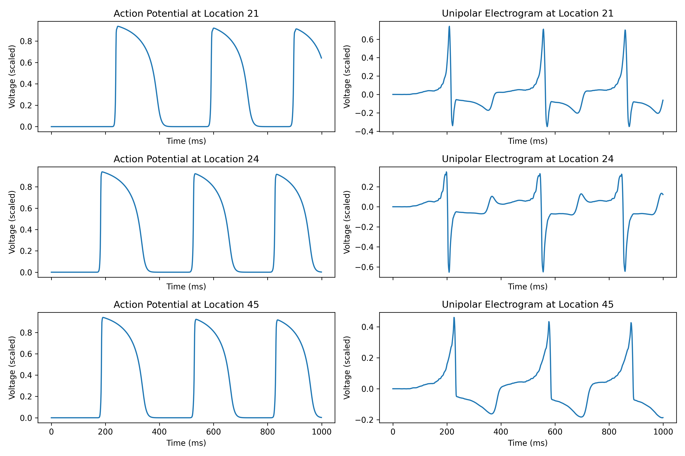
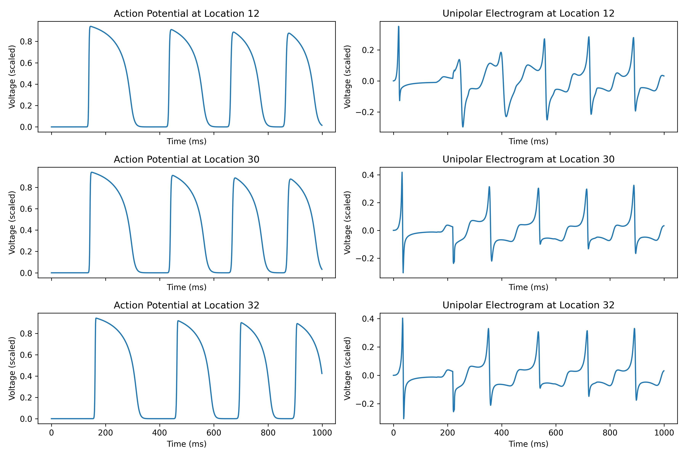

# Demonstration
Patient left atrium rotor and macro-reentry simulation:  
  
  
  

# Highlights
- This is an electrophysiological heart simulator written in **Python**.  
- Patient atria: 
  - A 3D triangular mesh database of the left and right atria. 
  - A total of **165 atria from 104 patients**: 104 left atria and 61 right atria.  
- Heart model: 
  - **Mitchell-Schaeffer**  
  - **Aliev-Panfilov**  
- Capability:  
  - It can simulate patient-specific focal and rotor **arrhythmias**, as well as fibrillation.  
  - It computes **action potentials** and **electrograms**.  
  - Besides 3D, it can also run 2D simulation.  
- Programming:  
  - It is deliberately written in a procedural programming style, using **simple** function calls rather than object oriented constructs like classes and inheritance, to maintain simplicity and ease of debugging.  
  - The code runs on Nvidia **GPU** for fast parallel computing.  
  - For solving the heart model equations, 4th-order Runge–Kutta is implemented for the reaction part, and Crank-Nicolson is implemented for the diffusion part. A zero-flux (Neumann) boundary condition is used to handle boundaries; since the geometry is fixed, a phase-field method is unnecessary.  

# Instructions
- Install dependencies: I have kept the dependencies intentionally minimal. You can use an AI tool to identify and install all required dependencies automatically. Also, make sure to install the CUDA Toolkit version that matches your specific NVIDIA GPU.
- Best to use Visual Studio Code on the Ubuntu Linux operating system. Edit /.vscode/settings.json to set your "python.defaultInterpreterPath".
- Run **heart_sim_individual.py** to compute a heart simulation. 
- Folder structure:  
  ├─ example/, examples of simulations.  
  ├─ legacy/, old functions that no longer in use, keeping them because they may be useful in the future.  
  ├─ mesh_database/, 3D triangular mesh database of the left and/or right atria.  
  ├─ simulation/, functions for running heart simulations.  
  ├─ tool/, useful standalone codes.  
  └─ utility/, functions for mesh processing, display, analysis, debug, etc.  

# Contributors
- **Jiyue He** -- Owner and main contributor. Jiyue He (Jay) received his PhD from the University of Pennsylvania, where he was honored with a student recognition award. As of 2026, He is a Postdoctoral Scholar at the University of California, San Francisco.
- **Arkady Pertsov** -- Theoretical and technical advisor. As of 2026, Pertsov is a Professor in the Department of Pharmacology at State University of New York, Upstate Medical University.
- **Mason Manetta** -- Implemented mesh processing to automatically correct defects and smooth surfaces while preserving overall geometry. As of 2026, Manetta is a Bioengineering PhD student at the University of California, Berkeley, and the University of California, San Francisco. 
- **John Bullinga** -- Provided de-identified patient atrial 3D triangular meshes. As of 2026, Bullinga is the Director of Electrophysiology Laboratories at Penn Presbyterian Medical Center of the University of Pennsylvania Health System.
- **Rahul Mangharam** -- Financial support. As of 2026, Mangharam is a Professor in the Departments of Electrical and Systems Engineering and Computer and Information Science at the University of Pennsylvania. 
- **Jan Christoph** -- Financial support. As of 2026, Christoph is a Professor at the University of California, San Francisco, and head of the Cardiac Vision Laboratory. He is a faculty member of the Cardiovascular Research Institute, with appointments in the Division of Cardiology, School of Medicine, and the Department of Bioengineering and Therapeutic Sciences. 

# The papers used this heart simulator
- Jiyue He, Arkady Pertsov, John Bullinga, Rahul Mangharam. (2023). Individualization of atrial tachycardia models for clinical applications: Performance of fiber-independent model. IEEE Transactions on Biomedical Engineering, vol. 71, no. 1, pp. 258-269. doi: 10.1109/TBME.2023.3298003
- Jiyue He, Arkady Pertsov, Elizabeth Cherry, Flavio Fenton, Caroline Roney, Steven Niederer, Zirui Zang, Rahul Mangharam. (2023). Fiber Organization Has Little Effect on Electrical Activation Patterns During Focal Arrhythmias in the Left Atrium. IEEE Transactions on Biomedical Engineering, vol. 70, no. 5, pp. 1611-1621. doi: 10.1109/TBME.2022.3223063
- Jiyue He, Arkady Pertsov, Rahul Mangharam. (2023). Real-time atrial tachycardia ablation guidance with a left atrium model. Heart Rhythm Society Abstract, volume 20, issue 5. doi: 10.1016/j.hrthm.2023.03.343
- Jiyue He, Arkady Pertsov, Sanjay Dixit, Katie Walsh, Eric Toolan, Rahul Mangharam. (2021). Patient-specific heart model towards atrial fibrillation. Proceedings of the ACM/IEEE 12th International Conference on Cyber-Physical Systems, New York, NY, USA, pp. 33-43. doi: 10.1145/3450267.3450532

# More demonstrations
Patient left atrium focal sources simulation:  
  
  

Patient left atrium fibrillation simulation:  
  
  

2D rotor simulation:  
  
  

# Private notes for myself
Mount from client  
sudo mount -t nfs 10.36.169.238:/mnt/hdd/jay/share_folder /mnt/jay
