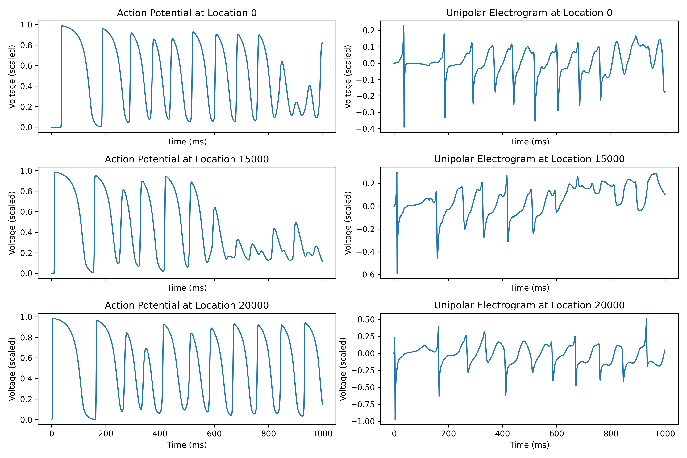
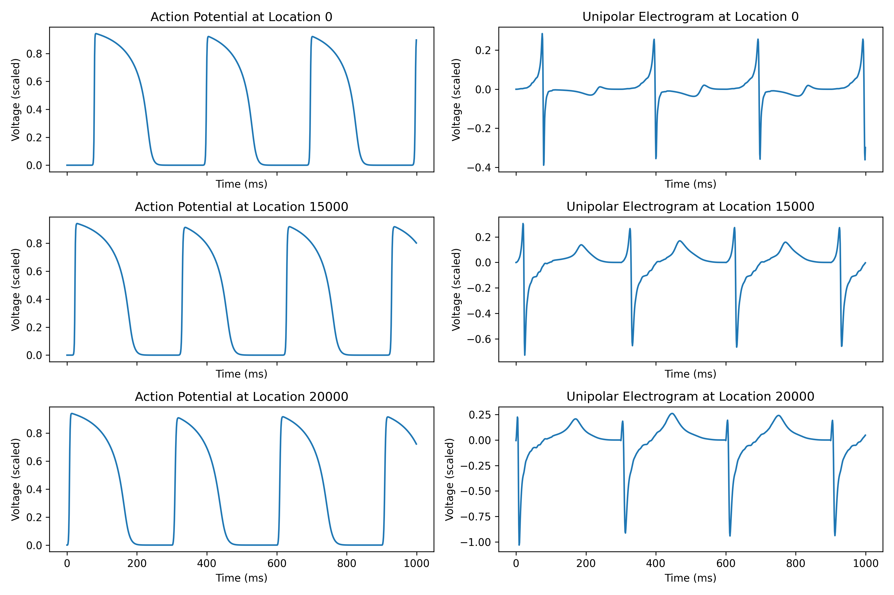

# Introduction
- This is an electrophysiological heart simulator written in Python.  
- It can simulate patient-specific focal and rotor arrhythmias. And simulate fibrillations.  
- It computes action potentials and electrograms.  
- The code runs on Nvidia GPU parallel computing.  
- For solving the heart model equations, 4th-order Runge–Kutta is implemented for the reaction part, and Crank-Nicolson is implemented for the diffusion part. 

# Instruction
- Run heart_sim_individual.py to compute one heart simulation. 
- Run heart_sim_batch.py to compute multiple heart simulations.  

# Examples of simulations
## Atrial fibrillation of a patient's left atrium
  
  

## Rotor arrhythmia of a patient's left atrium
  
  

## Focal arrhythmia of a patient's left atrium
  
  
